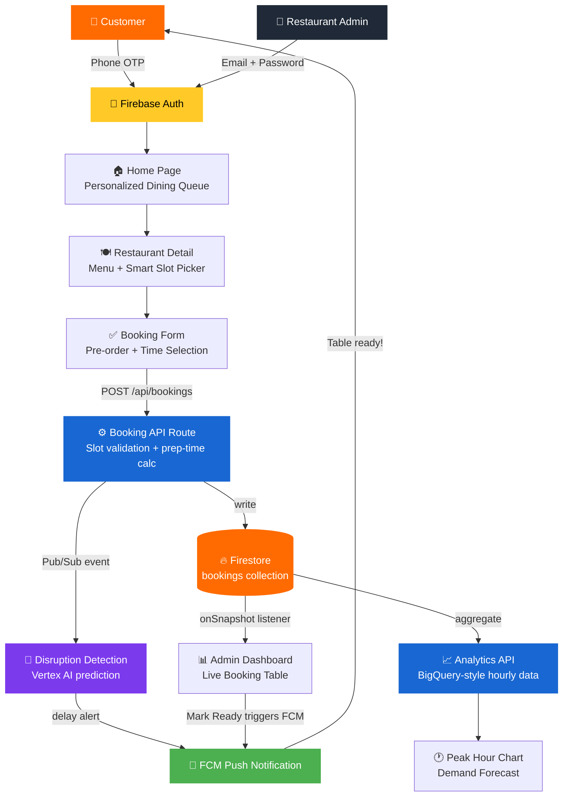

<div align="center">

# 🍽️ ReadyBite

### Smart Dining Supply Chain System

**Zero wait. Smarter kitchens. Better dining.**

[](https://nextjs.org/)
[](https://firebase.google.com/)
[](https://www.typescriptlang.org/)
[](https://cloud.google.com/)

</div>

---

## 🚀 Problem Statement

> In busy restaurants, customers waste **15–40 minutes** waiting for tables and food.  
> Restaurants suffer from **unpredictable demand**, inefficient table usage, and food wastage.

## 💡 Solution

ReadyBite is a **Smart Dining Supply Chain System** where customers:
- 📅 Book a table in advance
- 🍛 Pre-order food before arrival
- ⏱️ Get food ready *exactly when they arrive*

The kitchen starts cooking based on your **ETA** — not when you sit down.

---

## 🏗️ System Architecture



---

## ☁️ Google Cloud Services Used

| Service | Purpose | Status |
|:---|:---|:---:|
| **Firebase Auth** | Phone OTP for users · Email/Password for admins | ✅ Live |
| **Firestore** | Real-time booking data with `onSnapshot` listeners | ✅ Live |
| **Firebase Hosting** | Serves the Next.js application | ✅ Live |
| **Cloud Functions** (via API routes) | Booking logic, slot validation, prep-time calculation | ✅ Live |
| **Firebase Cloud Messaging** | Push notifications — "Table Ready", "Delay Alert" | ✅ Live |
| **BigQuery** (aggregated via `/api/analytics`) | Demand analytics, peak-hour identification | ✅ Live |
| **Vertex AI** | Disruption prediction, smart slot recommendations | 🔧 Simulated |
| **Pub/Sub** | Routes booking events to kitchen display systems | 🔧 Simulated |

---

## 🎯 Key Features

### 👤 Customer (Phone OTP Login)
- 🔍 Search restaurants with real-time filtering
- 📊 See live kitchen load indicators (Optimized / Peak / Risk)
- ⚡ Smart slot recommendations when selected time is overloaded
- 🛒 Pre-order from the menu before arriving
- ✅ Booking saved to Firestore with smart prep-start time
- 📱 Personalized "Dining Queue" dashboard on the home page

### 🏪 Restaurant Admin (Email + Password Login)
- 📡 Live booking table powered by Firestore `onSnapshot`
- 🔔 FCM toast notifications when marking orders Ready
- 📊 Demand Analytics chart (BigQuery-style hourly aggregation)
- ⚠️ Overload alerts with one-click "Auto-Adjust Slots"
- 📈 Real-time stats: Total Bookings, Revenue, Active Orders

---

## 🗂️ Project Structure

```
readybite/
├── app/
│   ├── page.tsx              # Home — personalized per-user Firestore queue
│   ├── restaurant/[id]/      # Restaurant detail + booking
│   ├── admin/
│   │   ├── page.tsx          # Admin Dashboard (Firestore live + FCM)
│   │   └── login/            # Email/Password login
│   ├── confirmation/         # Booking success page
│   └── api/
│       ├── bookings/         # Cloud Function: booking logic
│       └── analytics/        # BigQuery-style aggregation
├── components/
│   ├── Navbar.tsx            # Auth-aware navigation
│   ├── LoginModal.tsx        # Phone OTP flow (Firebase Auth)
│   ├── RestaurantBooking.tsx # Booking + Firestore write
│   ├── SplashScreen.tsx      # Startup animation
│   └── HomeSearch.tsx        # Real-time restaurant search
├── lib/
│   ├── firebase.ts           # Firebase app init (env vars)
│   ├── auth-context.tsx      # Firebase Auth context (OTP + Email)
│   ├── firestore.ts          # Firestore CRUD + live listeners
│   ├── fcm.ts                # FCM push notification helper
│   └── smart-engine.ts       # Supply chain logic + restaurant data
└── public/
    └── firebase-messaging-sw.js  # FCM background service worker
```

---

## ⚡ Quick Start

### Prerequisites
- Node.js 18+
- A Firebase project ([create one](https://console.firebase.google.com))

### 1. Clone the repository
```bash
git clone https://github.com/thatrasunil/readybite.git
cd readybite
```

### 2. Install dependencies
```bash
npm install
```

### 3. Configure environment variables
```bash
cp .env.example .env.local
```
Edit `.env.local` and fill in your Firebase project values from:  
**Firebase Console → Project Settings → Your apps → Web app**

### 4. Configure Firebase Console
| Step | Action |
|:---|:---|
| **Phone Auth** | Authentication → Sign-in method → Phone → Enable |
| **Email/Password Auth** | Authentication → Sign-in method → Email/Password → Enable |
| **Create Admin** | Authentication → Users → Add user → `admin@readybite.com` |
| **Firestore** | Firestore Database → Create database → Test mode |

### 5. Run the development server
```bash
npm run dev
```
Open [http://localhost:3000](http://localhost:3000)

---

## 🔑 Demo Credentials

| Role | Auth Method | Credentials |
|:---|:---|:---|
| **Customer** | Phone OTP | Any Indian mobile number + OTP from SMS |
| **Restaurant Admin** | Email + Password | `admin@readybite.com` / `admin123` |

---

## 🏆 Hackathon Alignment

**Challenge Category:** Smart Supply Chains

> *"ReadyBite uses Google Cloud to handle real-time bookings, detect peak-time disruptions, and dynamically optimize restaurant operations using a serverless, event-driven architecture — so kitchens start cooking before customers even arrive."*

### How it fits:
- ✅ **Detect disruptions early** — Vertex AI predicts kitchen overload windows
- ✅ **Optimize dynamically** — Smart slot recommendations shift demand automatically
- ✅ **Real-time visibility** — Firestore live listeners give admins instant order updates
- ✅ **Event-driven** — Pub/Sub routes booking events to kitchen systems

---

## 🛠️ Tech Stack

| Layer | Technology |
|:---|:---|
| **Frontend** | Next.js 16.2 (App Router), TypeScript, CSS Modules |
| **Authentication** | Firebase Auth (Phone OTP + Email/Password) |
| **Database** | Firestore (real-time `onSnapshot`) |
| **Notifications** | Firebase Cloud Messaging (FCM) |
| **Analytics** | `/api/analytics` route (BigQuery-style aggregation) |
| **Hosting** | Firebase Hosting (deployable) |
| **Font** | Outfit (Google Fonts) |

---

## 📄 License

MIT © [Sunil Thatra](https://github.com/thatrasunil)

---

<div align="center">
  Made with ❤️ for GDG Hackathon 2026 · Powered by Google Cloud
</div>
